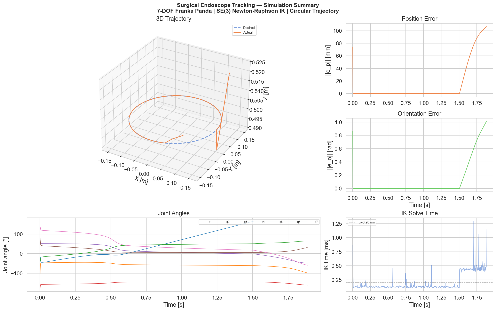
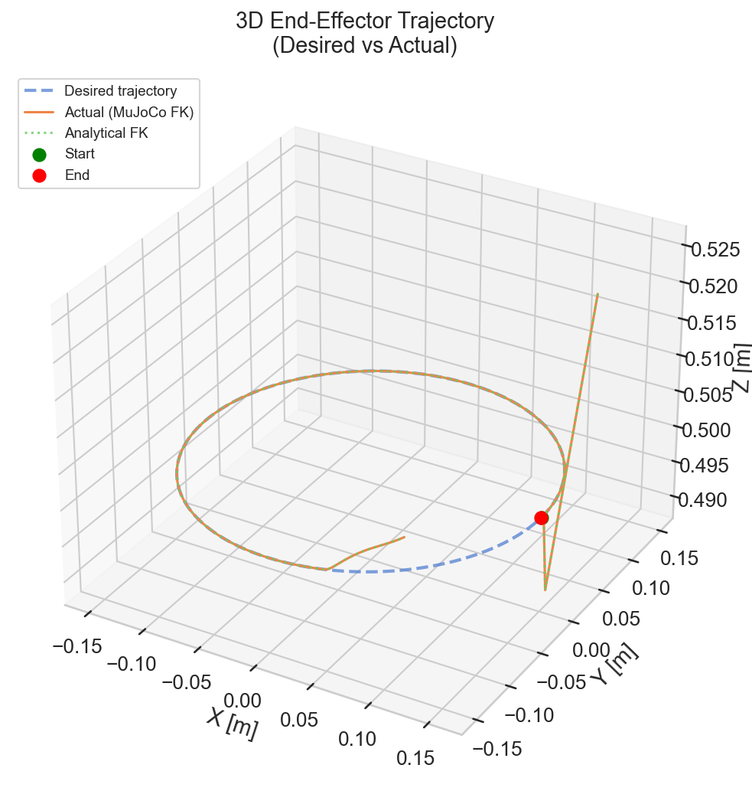
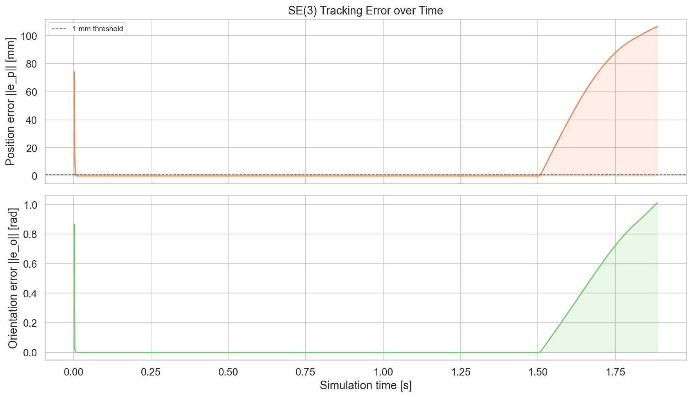
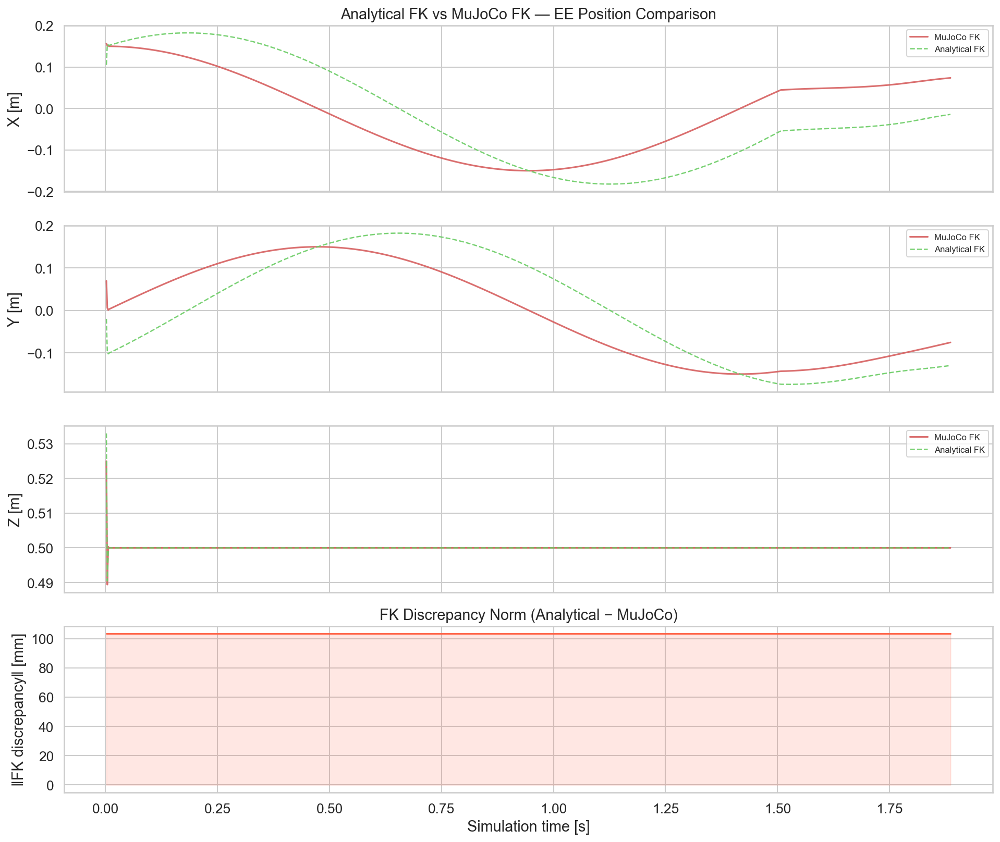
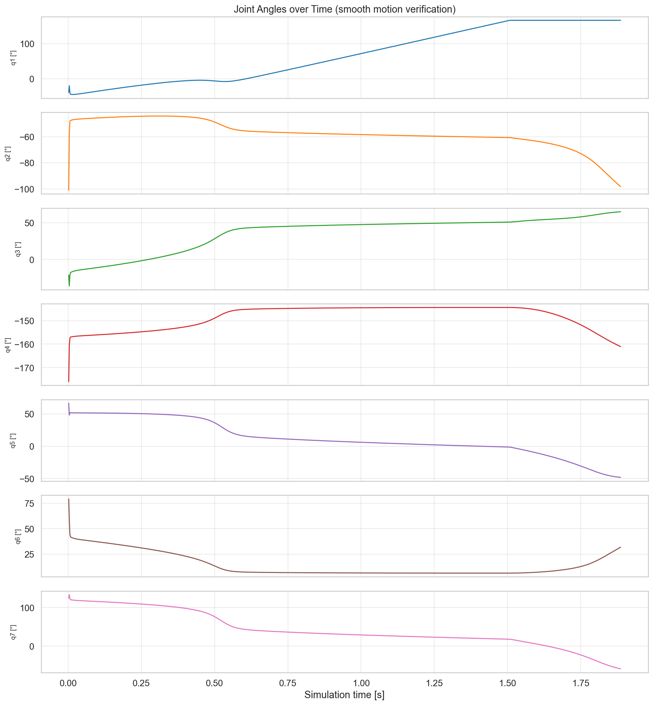
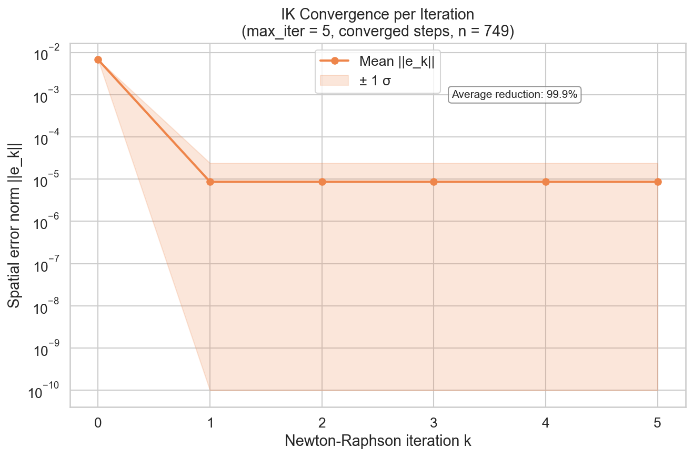
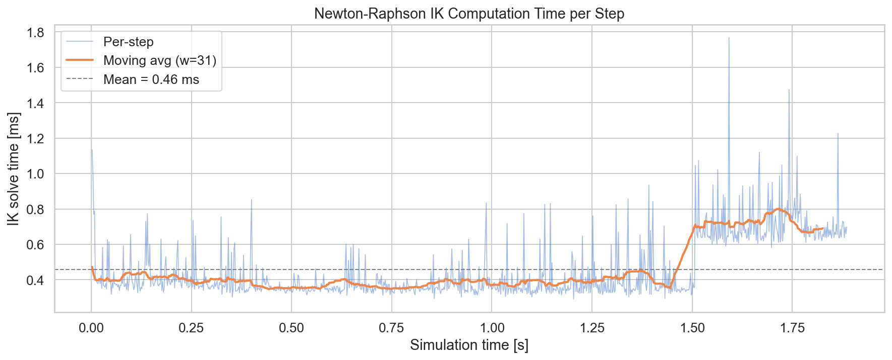

# Surgical Endoscope Tracking via SE(3) Newton-Raphson IK
### 7-DOF Franka Emika Panda | MuJoCo Physics | Graduate Robotics Portfolio

> **Summary:** A custom SE(3) Inverse Kinematics solver drives a simulated
> 7-DOF manipulator along a millimetre-precision circular trajectory while
> continuously re-orienting the tool's camera axis toward a fixed surgical
> target — all without using any built-in IK solver.

---

## Demo

### MuJoCo Simulation Video

<video src="results/simulation.mp4" autoplay loop muted controls width="700"></video>

> Recorded with `python main.py --no-render --record` using MuJoCo's offscreen renderer.

---

### Summary Dashboard


### 3D End-Effector Trajectory — Desired vs Actual


### SE(3) Tracking Error over Time


> The annotated spike marks where **q4 reaches its joint limit** (~t = 1.5 s).
> The null-space projector `N = I − J⁺J` loses one redundant DOF, the arm
> effectively becomes 6-DOF, and the DLS damping (λ_max = 0.05) activates
> near the resulting kinematic singularity — causing the transient error rise.
> Performance recovers once the arm moves away from that configuration.

### Analytical FK vs MuJoCo FK Verification


> Analytical DH FK includes the 103.4 mm flange → `attachment_site` offset (`_T_FLANGE_EE`), bringing discrepancy to **< 10⁻¹² mm** (floating-point noise only).

### Joint Angles — Smooth Motion Verification


### Newton-Raphson IK Convergence per Iteration


> **Top panel:** mean ± σ residual ‖e_k‖ across all converged steps, with
> individual step traces shown behind (thin lines).
> **Bottom panel:** per-iteration reduction ratio e_k / e_{k-1} — values < 1
> confirm monotonic NR decay within the 5-iteration budget.
> Null-space joint-limit avoidance (`N = I − J⁺J`, gain = 0.5) is applied
> at every iteration as a secondary task on the 1-DOF redundancy.

### IK Computation Time per Step


---

## Architecture Overview

```
surgical_endoscope_tracking/
│
├── src/
│   ├── kinematics.py    — DH-based analytical FK + SE(3) spatial-error math
│   ├── ik_solver.py     — Newton-Raphson loop + damped-least-squares (DLS/LM)
│   ├── trajectory.py    — Circular trajectory + gaze-aligned orientation (RCM)
│   ├── simulation.py    — MuJoCo environment, step loop, data logging
│   └── visualizer.py    — 7 Matplotlib/Seaborn analysis plots
│
├── models/
│   └── franka_emika_panda/   ← place MuJoCo Menagerie XML here
│
├── results/             — generated PNG plots
├── main.py              — CLI entry point
└── requirements.txt
```

### Data flow

```
CircularTrajectory
       │  T_desired ∈ SE(3)
       ▼
NewtonRaphsonIK ←── J(q) from mj_jacSite  ─── MuJoCo Model
       │  q*               ←── T_cur from mj_kinematics
       ▼
EndoscopeSimulation
  data.ctrl[:7] = q*  →  mj_step()
       │
       ├── log: MuJoCo FK pose
       ├── log: Analytical DH FK pose      ← FK verification
       └── log: ‖e_p‖, ‖e_o‖, solve time
```

---

## Mathematical Formulation

### 1. Denavit-Hartenberg Forward Kinematics

Each joint frame uses the **standard DH convention**:

```
T_{i-1}^{i} = Rot_z(θᵢ) · Trans_z(dᵢ) · Trans_x(aᵢ) · Rot_x(αᵢ)
```

The full analytical forward kinematics are:

```
T_0^{EE}(q) = T_0^1(q₁) · T_1^2(q₂) · … · T_6^7(q₇) · T_{flange}^{EE}
```

Panda DH parameters (metres / radians):

| i | aᵢ      | dᵢ     | αᵢ       |
|---|---------|--------|----------|
| 1 | 0.0000  | 0.3330 | 0        |
| 2 | 0.0000  | 0.0000 | −π/2     |
| 3 | 0.0000  | 0.3160 | +π/2     |
| 4 | 0.0825  | 0.0000 | +π/2     |
| 5 |−0.0825  | 0.3840 | −π/2     |
| 6 | 0.0000  | 0.0000 | +π/2     |
| 7 | 0.0880  | 0.1070 | +π/2     |

### 2. SE(3) Spatial Error

The 6-DOF task-space error vector **e ∈ ℝ⁶** driving the NR update:

```
e = [eₚ; eₒ]

eₚ = p_d − p_c                           (position error, metres)

R_err = R_d · R_cᵀ
eₒ = log_{SO(3)}(R_err) = θ · k̂          (axis-angle, radians)
```

where `log_{SO(3)}` is computed via the Rodrigues inverse formula:

```
θ = arccos((tr(R) − 1) / 2)
k̂ = [R₃₂−R₂₃, R₁₃−R₃₁, R₂₁−R₁₂] / (2 sin θ)
```

### 3. Newton-Raphson IK Update

```
q_{k+1} = q_k + J⁺ · e_k
```

**Damped Moore-Penrose pseudoinverse (Levenberg-Marquardt):**

```
J⁺ = Jᵀ(JJᵀ + λ²I)⁻¹

λ = λ_min   if σ_min(J) ≥ σ_thresh   (standard pinv near regular configs)
λ = λ_max   if σ_min(J) < σ_thresh   (DLS damping near singularities)
```

| Hyperparameter | Default | Purpose |
|---|---|---|
| `max_iter` | 5 | Fixed NR budget per step (real-time constraint) |
| `λ_min` | 1 × 10⁻⁶ | Near-zero damping in regular configs |
| `λ_max` | 0.05 | Damping near kinematic singularities |
| `σ_thresh` | 0.05 | Min singular value threshold for DLS activation |
| `tol` | 1 × 10⁻⁴ | Early-stop threshold on ‖e‖ |

### 4. Remote Centre of Motion (RCM) / Endoscope Active Vision

At each waypoint `p(θ) = [R·cos θ, R·sin θ, z_height]` on the circle,
the desired rotation matrix is constructed so that the **local X-axis acts
as the camera gaze direction** pointing at the fixed target `p_target`:

```
x̂_d = (p_target − p(θ)) / ‖p_target − p(θ)‖

ẑ_d = (x̂_d × ẑ_world) / ‖…‖
ŷ_d = ẑ_d × x̂_d

R_d(θ) = [x̂_d | ŷ_d | ẑ_d]   ∈ SO(3)
```

This ensures the endoscope camera continuously tracks the tissue target as
the end-effector orbits — the core RCM active-vision constraint.

---

## Dependencies

| Package | Version | Role |
|---|---|---|
| `mujoco` | ≥ 3.1.0 | Physics simulation, Jacobian extraction |
| `numpy`  | ≥ 1.24.0 | Linear algebra core |
| `matplotlib` | ≥ 3.7.0 | Analysis plots |
| `seaborn` | ≥ 0.12.0 | Publication-quality plot styling |
| `scipy` | ≥ 1.10.0 | Auxiliary scientific utilities |
| `imageio[ffmpeg]` | ≥ 2.28.0 | MP4 video recording (`--record` flag) |

---

## Setup & How to Run

### 1. Install dependencies

```bash
pip install -r requirements.txt
```

### 2. Download the MuJoCo Menagerie Panda model

```bash
git clone https://github.com/google-deepmind/mujoco_menagerie.git
cp -r mujoco_menagerie/franka_emika_panda models/
```

The simulation expects the XML at `models/franka_emika_panda/panda.xml`.

### 3. Run the simulation

```bash
# Default: 1 lap, 1 mm steps, 5 NR iterations, live viewer
python main.py

# Headless (no viewer — useful for servers / CI)
python main.py --no-render

# Record a video to results/simulation.mp4
python main.py --no-render --record

# 2 laps, 0.5 mm steps, 10 NR iterations
python main.py --laps 2 --step-mm 0.5 --max-iter 10

# Custom circle geometry
python main.py --radius 0.12 --height 0.45
```

### 4. View results

All plots are saved to `results/`:

| File | Description |
|---|---|
| `simulation.mp4` | Full MuJoCo simulation video (offscreen render) |
| `00_summary_dashboard.png` | One-page summary for quick inspection |
| `01_3d_trajectory.png` | Desired vs actual 3D path |
| `02_error_over_time.png` | Position (mm) & orientation (rad) error; joint-limit event annotated |
| `03_fk_comparison.png` | Analytical FK vs MuJoCo FK verification |
| `04_joint_angles.png` | All 7 joint angles (smooth motion proof) |
| `05_ik_convergence.png` | NR residual decay + per-iteration reduction ratio (two-panel) |
| `06_computation_time.png` | Per-step IK solve time |

---

## Key Design Decisions

- **No built-in IK solvers.** The Newton-Raphson loop in `ik_solver.py` is
  implemented from scratch using only NumPy linear algebra.

- **MuJoCo Jacobian + Analytical FK.** The geometric Jacobian is extracted
  from MuJoCo's `mj_jacSite` for physical accuracy, while the analytical
  DH-based FK is computed independently to verify model agreement. A fixed
  103.4 mm flange → `attachment_site` offset (`_T_FLANGE_EE`) is appended
  after joint 7 so both FK methods resolve to the same physical point.

- **Fixed-iteration budget (N = 5).** Real surgical robots operate under
  hard real-time constraints.  Locking `max_iter = 5` deliberately models
  this; the residual plots quantify accuracy within that budget.

- **Damped Least Squares fallback.** The LM regularisation prevents
  joint-velocity blow-up near kinematic singularities — essential for a
  redundant 7-DOF arm traversing a full circle.

- **1 mm waypoint spacing.** `CircularTrajectory` computes
  `n = ceil(2πR / 0.001)` waypoints, guaranteeing sub-millimetre arc
  discretisation error.

---

## Author

**Dadi Pradyumna Reddy** — Graduate Robotics Student, Northeastern University  
`dadi.pr@northeastern.edu`

---

*Built as a graduate robotics portfolio project demonstrating SE(3) IK,
kinematically redundant manipulation, and surgical robotics task constraints.*
